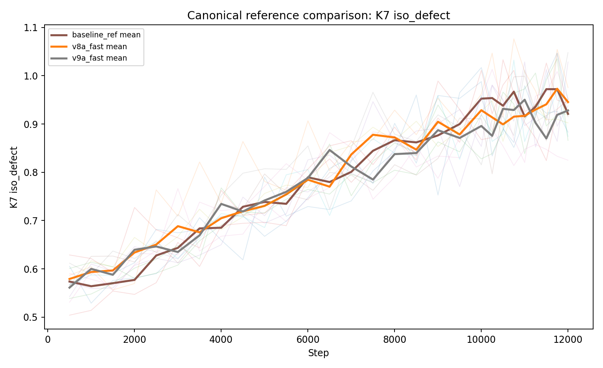
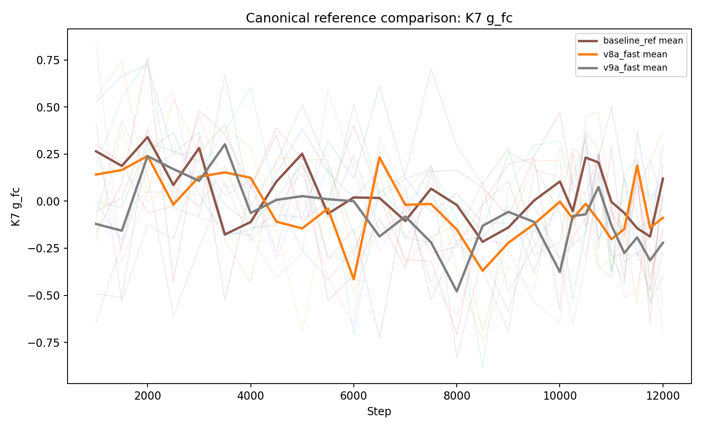
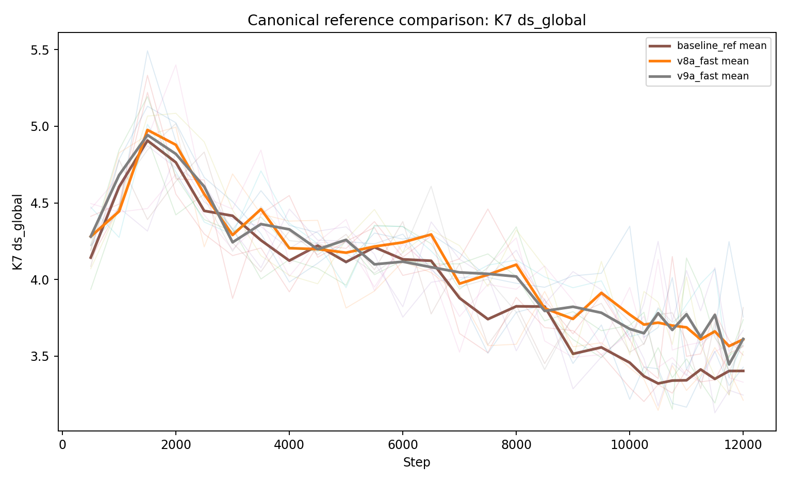

# Limits of Local Causal Edge Dynamics for Stabilizing Macroscopic Isotropic Geometry: A Canonical Three-Model Study
Christian Blab

## Abstract
We test a narrow hypothesis: whether a specific class of local, causal, edge-based update rules on growing directed graphs can stabilize macroscopic isotropic geometry. The contribution is not a claim of emergent spacetime. The contribution is a maintained modular engine, a canonical three-model ablation (`baseline_ref`, `v8a_fast`, `v9a_fast`), a reproducible diagnostics stack (K1, K2, K4, K5, K7), and a disciplined negative result.

Geometry is measured rather than assumed. This manuscript is bound to the committed evidence package under `paper/`: fixed run hash (`hash/results_and_figures_generation.txt`), canonical summary table (`results/summary/reference_table.json`), per-model summaries, and committed comparison figures. Across that fixed bundle, `v8a_fast` and `v9a_fast` produce local structural and transport retuning relative to `baseline_ref` (K1/K2/K4/K5/K7), but neither produces robust macroscopic isotropic stabilization: K7 isotropy defect remains high in all three models, and K7 front-core transport splitting remains unstable in sign and magnitude.

## 1. Introduction
This paper asks one focused question: **can this specific local causal mechanism class stabilize robust macroscopic geometry, as measured from graph dynamics alone?**

The study is boundary-test-driven. We do not assume an ambient manifold, target metric, or pre-imposed geometric law. We evaluate whether geometry-like behavior appears and remains stable under growth. If it does not, we report a bounded negative result for this local edge-based mechanism lineage rather than reinterpret failure as success.

Accordingly, geometry is operationalized through diagnostics: diffusion scaling, volume-growth scaling, concentration/efficiency/path structure, shell/front organization, and fixed-anchor isotropy and transport splits. These observables are designed to separate local structural improvements from true macroscopic geometric stabilization.

## 2. Canonical scope and implementation status
The maintained operational truth is the modular engine in:

- `emergent-geometry-causal-graphs/src/`
- canonical configs in `emergent-geometry-causal-graphs/configs/`
- canonical scripts in `emergent-geometry-causal-graphs/scripts/`

The **canonical scientific scope** of this manuscript is exactly:

- `baseline_ref` (`configs/baseline_ref.yaml`)
- `v8a_fast` (`configs/v8a_fast.yaml`)
- `v9a_fast` (`configs/v9a_fast.yaml`)

These canonical model identities are fixed mechanism labels; the committed paper evidence bundle is a separate fixed-output artifact produced via the paper-grade batch definition below.

Canonical batch definition:

- `configs/paper_batch_ref.yaml`

Archival monolith status:

- `archive/reference-monolith/` is provenance only and not operational truth.

Historical variants (e.g., V7/V7.1) are non-canonical and are not part of the main proof path.

## 3. Model
### 3.1 Growth process
At step $t$, the system is a growing directed weighted graph $G_t=(V_t,E_t)$ with binary node states $s_j\in\{0,1\}$. A new node is added each step (until `max_nodes`), chooses parents from existing nodes, and receives initial incoming edges.

### 3.2 Parent selection
For candidate parent $i$, the base score is

$$
S_i^{\mathrm{base}}=\exp\big(\alpha L_i + \beta C_i + \gamma N_i\big),
$$

with local density score

$$
L_i = \frac{1}{1+\lvert k_i^{\text{out}}-\rho^*(|V_t|-1)\rvert},
$$

and novelty

$$
N_i = \frac{1}{1+k_i^{\text{out}}}.
$$

Here $C_i$ is the candidate-parent local state-coherence score (state compatibility with the current local context), i.e., the same local coherence signal used by this parent-selection mechanism.

Parents are selected sequentially with genealogical repulsion using ancestry-signature Jaccard overlap

$$
J(i,\ell)=\frac{|A(i)\cap A(\ell)|}{|A(i)\cup A(\ell)|},
$$

and effective score

$$
S_i = S_i^{\mathrm{base}}\prod_{\ell\in P} \max(\varepsilon_r, 1-\lambda_r J(i,\ell)).
$$

### 3.3 State relaxation
Node states relax from weighted incoming influence:

$$
\bar s_j = \frac{\sum_{(i\to j)\in E_t^{\mathrm{act}}} w_{ij}s_i}{\sum_{(i\to j)\in E_t^{\mathrm{act}}} w_{ij}},\qquad
s_j=\mathbf 1[\bar s_j\ge 1/2].
$$

### 3.4 Baseline edge-update skeleton
For active edge $e=(i\to j)$, the update can be written as

$$
\begin{aligned}
w_e(t+1)=w_e(t)
&+\Delta_e^{\mathrm{coh}}
+\Delta_e^{\mathrm{cross}}
-\nu R_e
-\Gamma_e^{\mathrm{inh}}
-\Gamma_e^{\mathrm{crowd}}
-\Gamma_e^{\mathrm{load}}
-\Gamma_e^{\mathrm{plast}}\\
&-\Gamma_e^{\mathrm{center}}
-\Gamma_e^{\mathrm{excess}}
-\mu\big(w_e-w_0\big),
\end{aligned}
$$

with deactivation when

$$
w_e(t+1) < w_{\min}^{\mathrm{eff}}(j).
$$

The effective pruning threshold is density- and calibration-aware:

$$
w_{\min}^{\mathrm{eff}}(j)
= w_{\min}\big(1+\lambda_p\,p_j\big)\times\big(1+\alpha_{\mathrm{lift}}\,\max(0,\bar w-(w_{\star}+\epsilon_w))\big),
$$

where $p_j=\max(0,(k_j^{\mathrm{in}}-k_{\mathrm{target}})/k_{\mathrm{target}})$ and the second factor is active only when weight calibration is enabled.

### 3.5 Variant-specific terms

- **`baseline_ref`**: disables ball-integrity contrast, weight calibration, and V9 coherence terms.
- **`v8a_fast`**: enables local ball-integrity contrast and weight calibration.
- **`v9a_fast`**: inherits `v8a_fast` and additionally enables mesoscale ball-coherence.

For `v8a_fast`, the additional local ball-integrity term is

$$
\Delta_e^{\mathrm{ball}} = \min\left(c_{\mathrm{ball}},\max\left(-c_{\mathrm{ball}},\alpha_{\mathrm{ball}}\left[\omega_{\triangle}T_{ij}+\omega_{2h}H_{ij}+\omega_{\deg}D_j+\omega_{\mathrm{sh}}S_{ij}\right]\right)\right).
$$

where $T_{ij}$ is triangle support, $H_{ij}$ is two-hop coverage gain, $D_j$ is degree support, and $S_{ij}$ is shared-neighbor overlap.

Weight calibration in `v8a_fast` contributes centering and excess penalties:

$$
\Gamma_e^{\mathrm{center}} \propto \max(0,\bar w - w_{\star})\max(0,w_e - w_{\star}),\qquad
\Gamma_e^{\mathrm{excess}} \propto \max(0,w_e - (w_{\star} + \epsilon_w)).
$$

For `v9a_fast`, mesoscale ball coherence adds

$$
\Delta_e^{\mathrm{v9}} = \min\left(c_{\mathrm{v9}},\max\left(-c_{\mathrm{v9}},\alpha_{\mathrm{v9}}\left[\omega_{r2}N_{r2}+\omega_{r3}N_{r3}+\omega_{\mathrm{sec}}B_{\mathrm{sec}}-\omega_{\mathrm{red}}R_{\mathrm{inner}}+\omega_{\mathrm{front}}F_{\mathrm{thin}}N_{r3}\right]\right)\right).
$$

This term combines novelty at radius 2 and 3, sector balancing, inner redundancy suppression, and thin-front support.

## 4. Diagnostics framework
We use K1, K2, K4, K5, and K7.

- **K1 (structural stabilization):** active-edge count, degree moments, weight statistics, normalized degree entropy.
- **K2 (global diffusion/volume):** return probabilities $P(\tau)$, spectral dimension estimate, volume-growth dimension estimate on sampled BFS shadow regions.
- **K4 (concentration/efficiency/path):** incoming Herfindahl concentration, cluster dominance, sampled global efficiency, sampled path length.
- **K5 (shell/front morphology):** shell entropy, front thickness, peak shell index.
- **K7 (fixed-anchor diagnostics family):** repeated measurements around fixed seeds to separate true temporal drift from region-resampling effects.

### 4.1 K2 definitions
Spectral scaling uses return probabilities across walk horizons:

$$
P(\tau)\sim \tau^{-d_s/2}.
$$

Volume-growth scaling uses BFS-ball growth:

$$
V(r)\sim r^{d_v}.
$$

### 4.2 K7 isotropy concept and naming clarification
K7 includes anchor-local isotropy defect, diffusion splits (core/mid/front), and causal-front proxies. Isotropy defect is estimated from branch-imbalance statistics around sampled centers (coefficient-of-variation style radial imbalance): `iso_defect = 0` corresponds to perfect branch balance, and larger values indicate stronger directional imbalance (anisotropy). It should be read as an operational imbalance magnitude, not as a probability-like bounded 0-1 score.

**Naming clarification:** K7 is a diagnostics family label. It is not “Version 7.” Historical `v7`/`v71` model names are separate and non-canonical for this manuscript.

## 5. Experimental design and reproducibility
This paper is bound to the modular reproducibility chain:

1. **Config layer:** `baseline_ref`, `v8a_fast`, `v9a_fast` YAMLs.
2. **Batch layer:** `configs/paper_batch_ref.yaml` over fixed seeds.
3. **Raw outputs:** `results/raw/{model}/seed_{seed}.json`.
4. **Summary tables:** `results/summary/reference_table.json`.
5. **Figures:** `scripts/make_reference_figures.py`.
6. **Provenance:** record `git rev-parse HEAD` with results.

Reproducibility procedure is documented in `REPRODUCIBILITY.md`.

## 6. Results
This section is bound to the committed fixed evidence bundle under `paper/`: `results/summary/reference_table.json` (and matching per-model summaries), committed figures in `paper/figures/`, and the fixed run hash in `paper/hash/results_and_figures_generation.txt`.

### 6.1 Three-model structural trajectory (K1 and graph scale bookkeeping)
From the reference table, final K1 increases modestly across the canonical sequence: `baseline_ref` $0.7072\pm0.0103$, `v8a_fast` $0.7089\pm0.0084$, `v9a_fast` $0.7112\pm0.0082$ (mean±std; 5 runs each). Final active-edge count shifts from $46612.6\pm78.2$ to $47633.4\pm14.2$ and then $47629.2\pm10.7$, while final node count remains fixed at $12016$ for all three models.


Figure 1 should be read as a structural trajectory rather than a phase-transition plot: the variants tighten dispersion and slightly raise K1 while remaining in the same large-$N$ sparse regime with similar mean connectivity. Mechanistically, this is consistent with local edge-rule retuning that improves stability around a similar attractor, not a global reorganization into a distinct macroscopic geometry class.

### 6.2 K2 comparison: diffusion and volume scaling shift, but mixed
K2 spectral and volume estimates are model-sensitive but not monotonic in one direction. Final $d_s$ decreases across models (`baseline_ref`: $3.6069\pm0.5180$, `v8a_fast`: $3.3731\pm0.3909$, `v9a_fast`: $3.0902\pm0.4517$), while final $d_v$ increases from baseline to v9 (`baseline_ref`: $3.7284\pm0.3855$, `v8a_fast`: $4.3233\pm0.6255$, `v9a_fast`: $4.5884\pm0.8971$).


Figures 2 and 3 show a decoupled K2 response: $d_s$ shifts downward while $d_v$ shifts upward. Taken together, these plots indicate a mixed geometric response: transport and growth exponents decouple under local rule changes, which is evidence of retuning, but not of robust isotropic macroscopic closure.

### 6.3 K7 fixed-anchor evidence: local retuning persists, macroscopic isotropy does not
K7 fixed-anchor metrics remain the key boundary signal. In this study, successful macroscopic stabilization would have required a low K7 isotropy defect together with stable transport-sign structure (no persistent front/core sign flips) and no strong $d_s$/$d_v$ decoupling, while remaining in a nontrivial structural regime. Mean K7 isotropy defect is high for all three models (`baseline_ref`: $0.9209\pm0.0404$, `v8a_fast`: $0.9455\pm0.0592$, `v9a_fast`: $0.9280\pm0.0655$), so no model reaches low-defect isotropic behavior.







Figure 4 makes this explicit: variants move the defect value, but not into an isotropic regime. In parallel, Figure 5 shows that K7 front-core transport split $g_{fc}$ changes sign and magnitude (`baseline_ref`: $+0.119\pm0.235$, `v8a_fast`: $-0.089\pm0.303$, `v9a_fast`: $-0.221\pm0.221$). Mechanistically, that sign drift indicates persistent directional transport asymmetry anchored to local structure rather than convergence to a stable isotropic macrostate. Figure 6 shows K7 global exponents staying in a nearby band (~3.4-3.6), reinforcing that the failure mode is anisotropy persistence, not loss of all geometric organization.
The divergence between global K2 shifts and fixed-anchor K7 behavior is itself informative: local patch retuning does not translate into macroscopic isotropic closure.

### 6.4 K4/K5 support: local efficiency and shell organization improve
K4/K5 metrics provide supporting local improvements. Relative to baseline, both variants reduce incoming concentration (Herfindahl: $0.2592 \rightarrow 0.2519 \rightarrow 0.2512$) and cluster dominance ($0.5118 \rightarrow 0.5063 \rightarrow 0.5018$). `v9a_fast` also improves sampled global efficiency ($0.2061 \rightarrow 0.2062 \rightarrow 0.2142$) and lowers sampled path length ($5.137 \rightarrow 5.145 \rightarrow 4.987$). On K5, front thickness and shell entropy increase ($0.877 \rightarrow 0.936 \rightarrow 0.963$, $1.186 \rightarrow 1.306 \rightarrow 1.336$), indicating broader, more distributed shell fronts.

These K4/K5 shifts are meaningful local gains, but they do not overturn the K7 isotropy result. The combined evidence is therefore: local organization improves; macroscopic isotropic stabilization still fails.

## 7. Interpretation
The evidence supports a narrow negative conclusion: this local causal edge-dynamics line can self-organize transport and ball-like local structure but does not robustly stabilize macroscopic isotropic geometry.

A useful description is an **anisotropic diffusion-geometric patch medium**: the system forms persistent, structured, locally coherent transport patches without converging to a globally isotropic geometric phase.

## 8. Limitations
- The mechanism class is heuristic and local by construction.
- Simulations are finite in size, horizon, and seed count (5 runs per model): sufficient for mean/std comparisons and the qualitative negative conclusion, but underpowered for strong fine-grained ranking claims between `v8a_fast` and `v9a_fast`.
- Canonical scope is intentionally narrow (three models only).
- This is not a universal no-go theorem for emergence of geometry.
- Fixed-anchor diagnostics substantially reduce region-resampling ambiguity, but anchor neighborhoods still evolve as the graph grows, so K7 should be read as a strong operational control rather than a metaphysical guarantee of scale-invariant local identity.
- Diagnostics are strong operational proxies, not metaphysical proof.

## 9. Related work
**Causal-set and discrete-causality programs.** Causal-set research studies whether spacetime structure can be recovered from fundamentally discrete causal order, with continuum behavior emerging only in suitable limits (Surya, 2019). This paper overlaps at the level of causal/discrete motivation and the use of graph-like relational data. It differs in objective and claim strength: we do not test a full quantum-gravity reconstruction program, and we do not infer continuum recovery. We test a narrower algorithmic question about one local edge-update lineage in a growing directed graph engine.

**Dynamical graph models of emergent locality.** Quantum Graphity and related dynamical-graph approaches ask when locality and geometry-like phases can emerge from graph dynamics (Konopka, Markopoulou, and Severini, 2008). Our setup is closest to this tradition because locality must be induced by endogenous graph evolution rather than imposed geometry. The key difference is evidential posture: instead of proposing a new positive phase claim, we run a canonical three-model ablation and report a bounded negative result for this local mechanism lineage when macroscopic isotropic stabilization is not observed.

**Higher-order and simplicial network geometry.** Network Geometry with Flavor and subsequent network-geometry work construct higher-order combinatorial structures (simplicial complexes and related growth rules) to study emergent geometric organization and complexity (Bianconi and Rahmede, 2016; Mulder and Bianconi, 2018). Our models are edge-centric and pairwise, so these papers are better viewed as adjacent alternatives than direct baselines. This comparison clarifies scope: our negative finding concerns a local edge-based mechanism class and does not rule out higher-order generative mechanisms.

**Discrete graph-geometric diagnostics and curvature.** Discrete curvature literature develops operational geometric probes on networks, including comparative studies of curvature discretizations and convergence links between Ollivier curvature on random geometric graphs and manifold Ricci curvature (Samal et al., 2018; van der Hoorn et al., 2023). We align with this diagnostics-first philosophy: geometry is measured via operational statistics rather than assumed. However, our diagnostics stack (K1/K2/K4/K5/K7) is used to test and bound stability claims for a specific mechanism lineage, not to assert a universal geometric no-go theorem. Accordingly, this manuscript does **not** refute graph-based or pregeometric emergence programs in general; it provides a reproducible bounded negative result for one narrower local causal edge-dynamics lineage under the canonical three-model protocol.

## 10. Conclusion
Within the canonical modular engine and canonical three-model scope (`baseline_ref`, `v8a_fast`, `v9a_fast`), the committed fixed evidence bundle supports a consistent bounded negative result: local retuning occurs, but macroscopic isotropic stabilization is not achieved for this tested local edge-based lineage.

Across the reference summaries and committed figures, K1/K2/K4/K5 show measurable structural and transport adjustments, including lower concentration and stronger local efficiency in `v9a_fast`. However, K7 isotropy defect remains high across all models and K7 front-core transport splitting remains sign-unstable, so no canonical variant establishes a stable isotropic macrostate. Future progress likely requires stronger nonlocal consistency constraints or higher-order relational mechanisms beyond this local edge-update class.

## 11. Reproducibility note
This manuscript is explicitly tied to the committed fixed evidence bundle under `paper/`:

- fixed run/figure generation hash: `paper/hash/results_and_figures_generation.txt` = `75208cf390c1196b9a0bbb9aff5f50d45b6f727e`
- canonical aggregate table: `paper/results/summary/reference_table.json`
- per-model summaries: `paper/results/summary/baseline_ref_summary.json`, `v8a_fast_summary.json`, `v9a_fast_summary.json`
- committed figures used in Results: `paper/figures/reference_k1_trajectory.png`, `reference_k2_ds_comparison.png`, `reference_k2_dv_comparison.png`, `reference_k7_iso_defect_comparison.png`, `reference_k7_g_fc_comparison.png`, `reference_k7_ds_global_comparison.png`

Code and committed paper artifacts are in the GitHub repository `cblab/raumzeit`, under `emergent-geometry-causal-graphs/`.

Regeneration workflow remains:

```bash
python scripts/run_batch.py --config configs/paper_batch_ref.yaml
python scripts/summarize_results.py
python scripts/make_reference_figures.py
git rev-parse HEAD
```

## Code and data availability
Code, committed paper artifacts, and the fixed-evidence bundle are available in the GitHub repository `cblab/raumzeit`, with the relevant project under `emergent-geometry-causal-graphs/`. This manuscript is tied to the committed fixed evidence bundle identified in the reproducibility note above.

Interpretive claims in this manuscript are bound to the committed artifacts above, not to uncommitted local outputs.

## References

For this Markdown/PDF manuscript version, references are provided as the explicit list below; `paper/references.bib` is retained in-repo for bibliography-source compatibility and provenance.

1. Surya, S. (2019). *The Causal Set Approach to Quantum Gravity*. Living Reviews in Relativity, 22(1), 5. https://doi.org/10.1007/s41114-019-0023-1

2. Konopka, T., Markopoulou, F., & Severini, S. (2008). *Quantum Graphity: A Model of Emergent Locality*. Physical Review D, 77, 104029. https://doi.org/10.1103/PhysRevD.77.104029

3. Bianconi, G., & Rahmede, C. (2016). *Network Geometry with Flavor: From Complexity to Quantum Geometry*. Physical Review E, 93, 032315. https://doi.org/10.1103/PhysRevE.93.032315

4. Mulder, D., & Bianconi, G. (2018). *Network Geometry and Complexity*. Journal of Statistical Physics, 173, 783–805. https://doi.org/10.1007/s10955-018-2115-9

5. Samal, A., Sreejith, R. P., Gu, J., Liu, S., Saucan, E., & Jost, J. (2018). *Comparative Analysis of Two Discretizations of Ricci Curvature for Complex Networks*. Scientific Reports, 8, 8650. https://doi.org/10.1038/s41598-018-27001-3

6. van der Hoorn, P., Lippner, G., Trugenberger, C., & Krioukov, D. (2023). *Ollivier Curvature of Random Geometric Graphs Converges to Ricci Curvature of Their Riemannian Manifolds*. Discrete & Computational Geometry, 70, 671–712. https://doi.org/10.1007/s00454-023-00507-y
